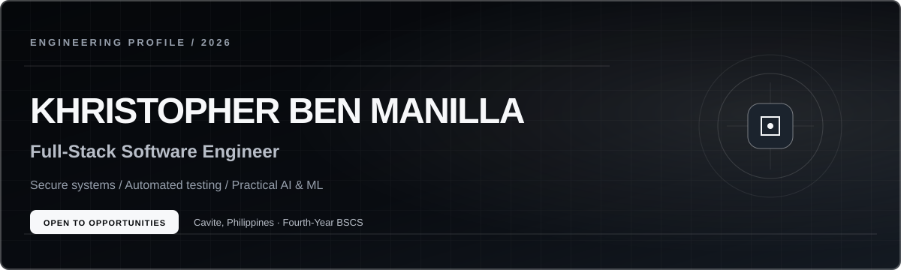
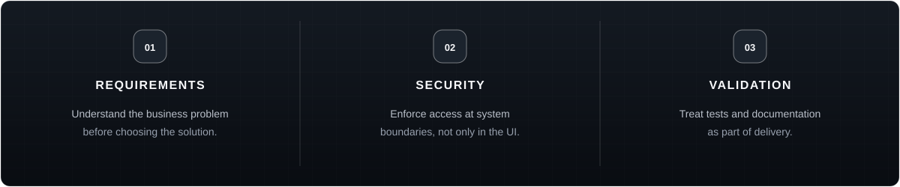

  

  4th Year CS Student, LPU–Cavite &nbsp;·&nbsp; Intern @ Startup Lab PH &nbsp;·&nbsp; Tanza, Cavite, PH

 

I build practical, production-oriented software across full-stack web development, AI integration, and cybersecurity — systems designed to solve real problems, not showcase isolated coding exercises.

## Current Focus

- Full-Stack Web Development
- Artificial Intelligence Integration
- SaaS Application Development
- Cybersecurity Research
- Workforce Management Systems
- Event Marketplace Platforms
- System Architecture & Database Design
- AI-Powered Intrusion Detection Systems (IDS)

**Exploring next:** Machine Learning for Cybersecurity · Local LLMs · Genetic Algorithms · DevOps best practices

## Featured Projects

### [TimeForge](https://github.com/kbmanilla06/TimeForge) — Flagship Project

AI-powered workforce performance management system: time tracking, smart timesheets with supervisor approval, daily scrum reporting, KPI management, payroll preparation with PDF/Excel exports, management dashboards, and on-demand AI insights — built as a feature-complete MVP across 14 tracked sprints.

| | |
|---|---|
| **Problem** | Organizations tracking attendance, updates, and payroll across spreadsheets and chat apps end up with fragmented workflows and no real visibility into productivity. |
| **Stack** | Laravel 13 (PHP, PostgreSQL, Sanctum) · React 19 + TypeScript + Vite + Tailwind + React Router · Docker · GitHub Actions |
| **Status** | Active development |

<b>Engineering detail</b> — four server-enforced roles, 211 backend + 186 frontend tests, AI with zero external calls

 

Every role boundary (Admin/HR/Supervisor/Employee) is enforced server-side via policies and middleware, backed by 211 PHPUnit tests and 186 Vitest tests. The seven AI insight features (summaries, blocker detection, KPI analysis, payroll validation) run on a provider-agnostic architecture currently backed by a local deterministic stub — zero external API calls, zero credentials, and every output is append-only with a full source-data audit snapshot, explicitly labeled AI-generated.

 

### [Customer Churn Prediction](https://github.com/kbmanilla06/customer-churn-prediction)

End-to-end ML pipeline predicting telecom customer churn, with a Streamlit dashboard for model comparison and real-time prediction.

| | |
|---|---|
| **Problem** | Retaining a customer is cheaper than acquiring one — this identifies at-risk customers before they leave. |
| **Stack** | Python · Pandas · Scikit-learn · XGBoost · Streamlit |
| **Status** | Completed / portfolio project |

<b>Engineering detail</b> — SMOTE applied inside the CV loop to prevent data leakage

 

Class imbalance is handled with SMOTE oversampling combined with `class_weight="balanced"`. Critically, SMOTE runs *inside* a stratified 5-fold cross-validation loop via `imblearn.Pipeline`, not before the train/test split — preventing synthetic samples from leaking across folds. Logistic Regression, Random Forest, and XGBoost are compared on F1 (primary, given the asymmetric cost of missed churners) and ROC-AUC (secondary).

 

### ML-Enhanced Intrusion Detection System — Research Prototype

Adaptive IDS combining Random Forest classification with Genetic Algorithm–based feature selection, aimed at improving detection of novel attacks while reducing false positives versus traditional signature-based IDS.

`Python` · `Scikit-learn` · `Random Forest` · `Genetic Algorithms` — *private research repository*

### Vote Secure — Favorite Project

Secure digital voting platform focused on authenticated, tamper-resistant elections — one verified ballot per voter, with vote validation preserving election integrity.

`Python` · SQL · Authentication system — *private repository, completed academic project*

### Cybercrime Expert System

Rule-based expert system with an inference engine and knowledge base that helps users identify cybercrime incidents and recommends appropriate legal/technical responses.

`Python` · Rule-based expert system · SQL — *private repository, completed academic project*

## Capability Matrix

*(bold = primary daily-use, plain = comfortable, `code` = actively learning)*

| Category | Stack |
|---|---|
| **Languages** | **Python**, **TypeScript**, **JavaScript**, PHP, SQL |
| **Frameworks** | **Next.js**, **React**, NestJS, Laravel, Tailwind CSS, ShadCN UI |
| **Libraries** | React Hook Form, Zod, Zustand, TanStack Table, Recharts |
| **Databases** | **PostgreSQL**, Supabase Database |
| **AI Tools** | **OpenAI GPT**, **Claude / Claude Code**, NotebookLM, Bolt |
| **Machine Learning** | **Scikit-learn**, Random Forest, `Genetic Algorithms`, `Local LLMs` |
| **Cybersecurity** | RBAC, Row-Level Security, OTP Authentication, `Intrusion Detection Systems`, `AI-Based Network Security` |
| **DevOps / Cloud** | Docker, GitHub Actions, Vercel, Supabase |
| **Tooling** | VS Code, Git, GitHub, npm, Composer, Artisan CLI, Postman, Figma |

## Engineering Principles

Before writing code, I focus on understanding the business problem and planning how components interact. Good software should be easy to extend, simple to maintain, and reliable enough to support future growth — not showcase unnecessary complexity.

## Contact

[GitHub](https://github.com/kbmanilla06) &nbsp;·&nbsp; [Portfolio](https://kbmanilla06.github.io/) &nbsp;·&nbsp; [LinkedIn](https://www.linkedin.com/in/khristopher-ben-manilla-b875181b6/) &nbsp;·&nbsp; [Email](mailto:kbmanilla06@gmail.com)

Open to full-time and part-time roles in AI engineering, full-stack development, and cybersecurity — also open to research and collaboration.

